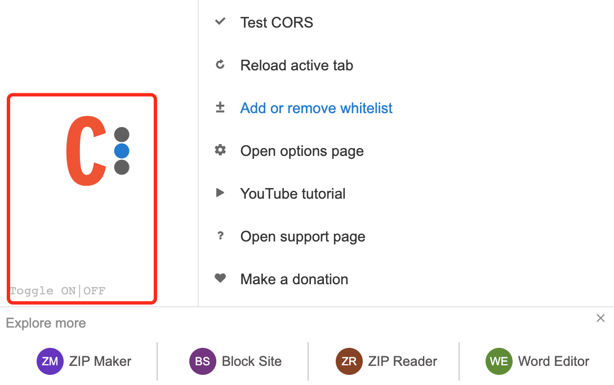
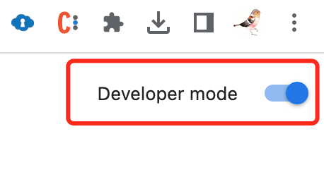
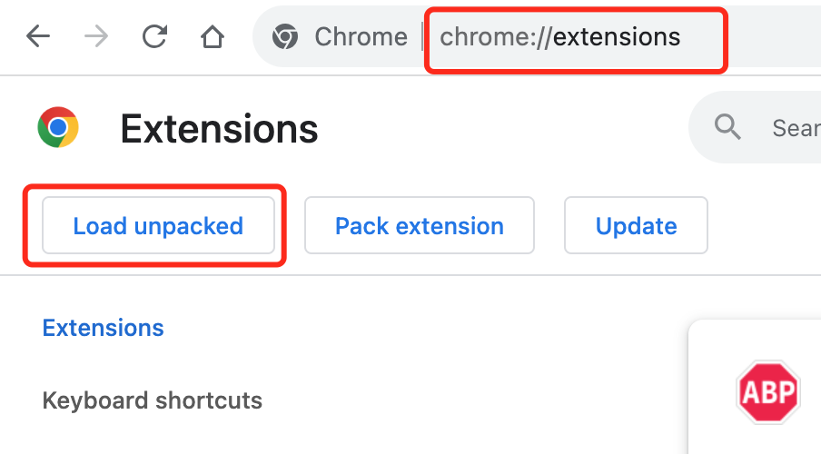
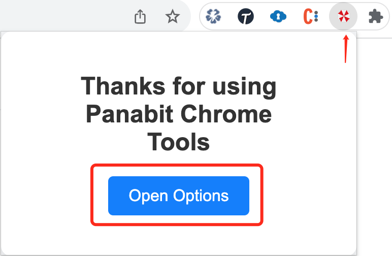
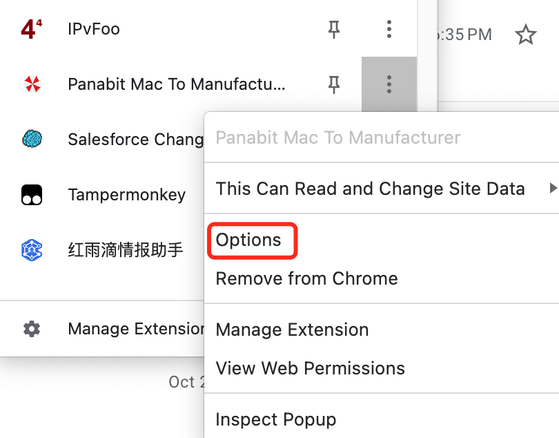
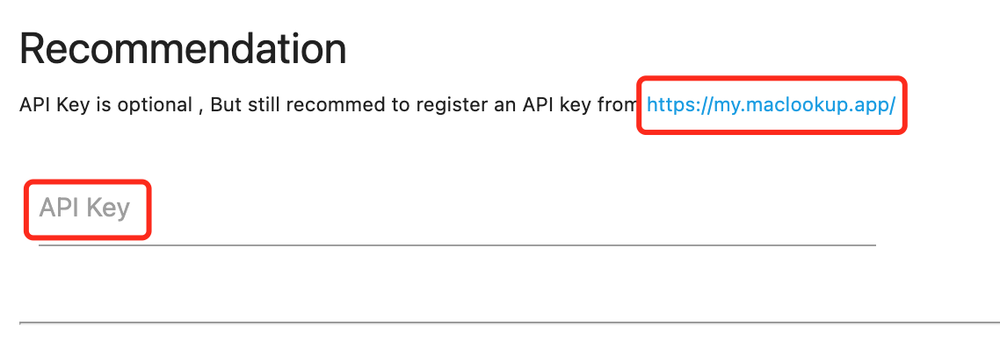
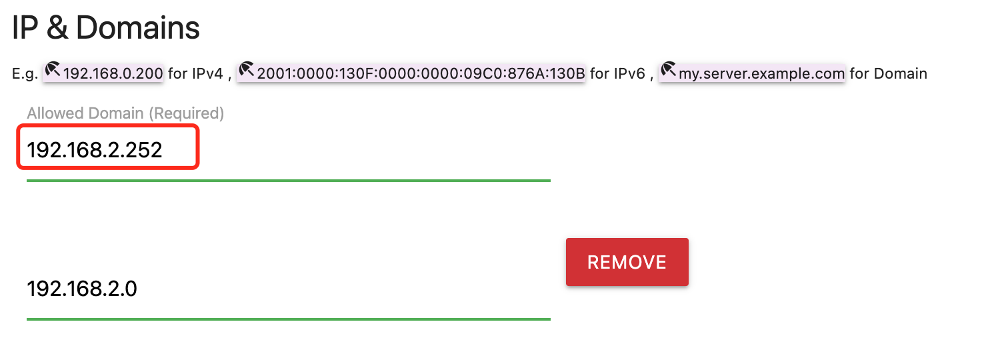

# **Panabit** Chrome 工具使用手册

## Table of Content

- [**Panabit** Chrome 工具使用手册](#panabit-chrome-工具使用手册)
  - [Table of Content](#table-of-content)
  - [1.前置条件](#1前置条件)
    - [1.1 安装 Chrome CROS 插件](#11-安装-chrome-cros-插件)
    - [1.2 安装工具插件](#12-安装工具插件)
  - [2. 配置插件](#2-配置插件)
    - [2.1 配置 API key](#21-配置-api-key)
    - [2.2 填写需要应用插件的域名或者 IP](#22-填写需要应用插件的域名或者-ip)
    - [3 Issues](#3-issues)

## 1.前置条件

### 1.1 安装 Chrome CROS 插件

[Allow CORS: Access-Control-Allow-Origin](https://chrome.google.com/webstore/detail/allow-cors-access-control/lhobafahddgcelffkeicbaginigeejlf)

安装后启用插件，一定要点 ON 那个按钮，也就是 logo 变彩色。



### 1.2 安装工具插件

- Release 发布链接暂无， 要上架 Chrome Store 才有 (目前在验证付款中)

- 手工安装

1. 手工安装，[点击下载这个插件Zip包](https://github.com/unizhu/panabit-chrome-addon/archive/refs/heads/main.zip)
2. 解压缩这个文件夹至某个目录
3. 打开 Chrome 插件/Extension 的 开发者模式



3.1 如果找不到，直接浏览器地址栏输入 `chrome://extensions/` [chrome://extensions/](chrome://extensions/)
3.2 在 Chrome 的插件里选择打开这个文件夹



## 2. 配置插件

1. 点击装好插件的图标，对，就是那把雨伞。点击里面的 `Open Options` 按钮


2. 或者安装好以后在 Chrome 插件里 选择 配置/Option



### 2.1 配置 API key

[去 maclookup.app 申请一个 key](https://my.maclookup.app/)

然后填进到 API Key 里



```text
    - 注意：如果不填 api key 也能用，但是会有一堆 HTTP 429 的返回，就是服务器限制请求数量的意思
    - 请求过的 MAC 地址会缓存到本地，不会重复请求
```

### 2.2 填写需要应用插件的域名或者 IP



```markdown
    + 注意：如果不填 IP 也能用，但是最好填一个, 不然就是只判断网页名叫Panabit的窗口
    + 也支持 IPv6 和 域名
```

### 3 Issues

- Known Issue: 验证配置的 ip 地址还有点小毛病
  
- 其他请去 [Issues](https://github.com/unizhu/panabit-chrome-addon/issues) 里提
